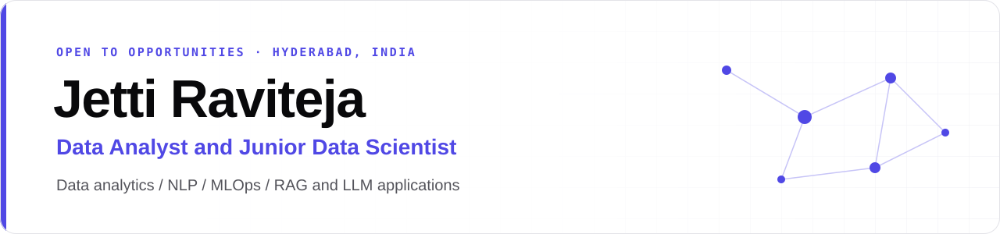

  
  
  

I am a Computer Science graduate (B.Tech, AI & ML, 2026) who builds end-to-end data and machine learning systems, from business dashboards and NLP classifiers to retrieval-augmented LLM applications served behind tested, containerised APIs. I evaluate every component against a baseline and report the result as measured, including when the simpler approach wins.

**Currently:** open to roles in Data Analytics, Data Science and AI.

## Selected Work

### Machine Learning and AI

| Project | Description | Result |
| :-- | :-- | :-- |
| [**JobLens**](https://github.com/raviteja311/JobLens-AI-Job-Market-Assistant) | RAG assistant over live AI/ML job postings: hybrid search on pgvector, grounded chat with citations, resume matching and market trends. | 0.653 recall@10 on a 58-query golden set, CI-gated retrieval, 252 tests |
| [**Support Ticket Classification**](https://github.com/raviteja311/Automated-Support-Ticket-Classification) | Production-shaped MLOps service with FastAPI, an MLflow model registry, DVC, Evidently drift monitoring, Docker and CI. | 0.917 macro-F1 on 2,617 held-out messages |
| [**Sentiment Analysis**](https://github.com/raviteja311/Sentiment-Analysis) | Logistic regression, Bi-LSTM, Bi-GRU and fine-tuned RoBERTa compared on TweetEval, served through a rate-limited API. | 0.712 test macro-F1 (RoBERTa), 512 tests |
| [**Movie Genre Classification**](https://github.com/raviteja311/MOVIE-GENRE-CLASSIFICATION) | 27-class genre classifier from title and plot, packaged as an installable library with a CLI and app. | 59.1% accuracy, 81.5% top-3 |

### Products

| Project | Description | Links |
| :-- | :-- | :-- |
| [**easyjobs**](https://github.com/raviteja311/easyjobs) | Map-first job board across 15 Indian cities, fed nightly from five applicant tracking systems into PostGIS. | [Live](https://easyjobs-seven.vercel.app) · [Code](https://github.com/raviteja311/easyjobs) |
| [**On-Topic**](https://github.com/raviteja311/On-Topic) | Distraction-free YouTube topic search with server-side API calls, quota caching and shareable searches. | [Live](https://on-topic-two.vercel.app) · [Code](https://github.com/raviteja311/On-Topic) |
| [**Dog vs Cat Classifier**](https://github.com/raviteja311/dog-cat-classifier) | Image classifier behind a Streamlit app, returning a label with a confidence score. | [Code](https://github.com/raviteja311/dog-cat-classifier) |

The three projects under Products were built quickly with AI coding tools.

## Experience

**Business Analytics Intern**, ThinkMates EduTech Pvt. Ltd. · Jul 2025 to Aug 2025 
Analysed 12,000+ restaurant records in Python, Excel and Power BI, and built three dashboards for sales, manager and CEO audiences.

## Tech Stack

  
   
  

| Area | Tools |
| :-- | :-- |
| Data and analytics | pandas, NumPy, SQL, Power BI, Excel, Matplotlib, Seaborn |
| Machine learning | scikit-learn, PyTorch, TensorFlow / Keras, Hugging Face Transformers |
| LLMs and retrieval | RAG, pgvector, sentence-transformers, cross-encoder reranking, LoRA / PEFT, Ollama, Anthropic API |
| MLOps | FastAPI, Docker, GitHub Actions, MLflow, DVC, Evidently, Prometheus, Grafana, pytest |

## Certifications

| Certification | Issuer | Date |
| :-- | :-- | :-- |
| Certified Generative AI Professional | Oracle | Oct 2025, valid to Oct 2027 |
| Certified System Administrator | ServiceNow | Jul 2025 |
| Generative AI Fundamentals | Databricks | Apr 2025 |
| Getting Started with AI | IBM | Feb 2025 |

Additional courses

 

| Course | Provider | Date |
| :-- | :-- | :-- |
| Prompt Engineering for Everyone | CognitiveClass.ai | Apr 2025 |
| Generative AI | LinkedIn Learning | Apr 2025 |
| Python for Data Analysis | CognitiveClass.ai | Jan 2025 |

## Education

**B.Tech, Computer Science and Engineering (AI & ML)**, TKR College of Engineering and Technology, Hyderabad · 2022 to 2026 · CGPA 7.99

---

Full project write-ups are on my <a href="https://portfolio-website-drab-six-15.vercel.app">portfolio</a>.

